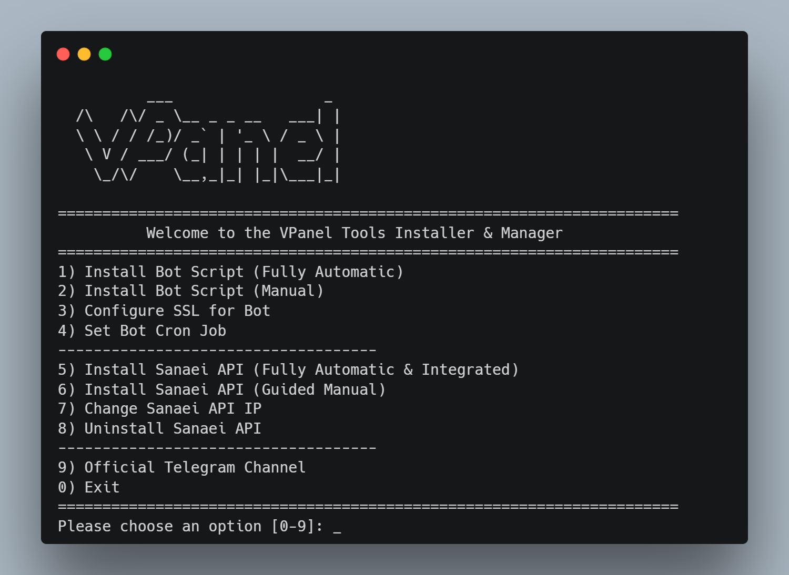

# VPanel Installer



**اسکریپت نصب و مدیریت ابزارهای VPanel**

یک اسکریپت Bash جامع و حرفه‌ای برای نصب و مدیریت آسان "ربات VPanel" و "Sanaei API" بر روی سرورهای لینوکس (مبتنی بر دبیان/اوبونتو). این اسکریپت فرآیندهای پیچیده‌ی نصب وب‌سرور، دیتابیس، PHP، و پیکربندی‌های مربوطه را به صورت خودکار انجام می‌دهد.

-----

## 🚀 ویژگی‌های کلیدی

  * **نصب تمام اتوماتیک ربات (Bot):** نصب Nginx، MySQL، PHP 8.2 و دانلود و پیکربندی کامل ربات با دریافت اطلاعات از کاربر.
  * **نصب تمام اتوماتیک API (Sanaei API):** نصب وابستگی‌ها، Composer، کلون کردن پروژه و راه‌اندازی به عنوان یک سرویس `systemd` (پورت 8009).
  * **مدیریت SSL:** نصب خودکار SSL با Let's Encrypt (Certbot) یا نصب دستی گواهی‌های شخصی.
  * **راه‌اندازی Cron Job:** تنظیم خودکار Cron Job لازم برای اجرای `scheduler.php` ربات.
  * **ابزارهای مدیریتی API:** امکان تغییر IP و حذف کامل Sanaei API.
  * **منوی کاربری آسان:** یک رابط کاربری مبتنی بر منو (TUI) برای دسترسی آسان به همه‌ی ابزارها.

-----

## 📋 پیش‌نیازها

برای استفاده از این اسکریپت، شما به موارد زیر نیاز دارید:

  * یک سرور با سیستم‌عامل **Debian** یا **Ubuntu** (مانند اوبونتو 20.04 یا 22.04).
  * دسترسی `root` یا یک کاربر با دسترسی `sudo`.

-----

## ⚡️ نصب و اجرا

1.  ابتدا دستور زیر را اجرا کنید.

    ```bash
    wget -O vpanel-installer.sh https://raw.githubusercontent.com/vpaneladmin/vpanel-bash/main/vpanel-installer.sh
    
    chmod +x vpanel-installer.sh
    ```

2.  اسکریپت را با دسترسی `sudo` اجرا کنید:

    ```bash
    sudo ./vpanel-installer.sh
    ```

-----

## 🛠 گزینه‌های منو

پس از اجرا، منوی زیر به شما نمایش داده خواهد شد:

### مدیریت ربات (Bot Management)

1.  **Install Bot Script (Fully Automatic):**

      * نصب کامل Nginx, MySQL, PHP 8.2.
      * ساخت خودکار دیتابیس و کاربر (اطلاعات در پایان نمایش داده می‌شود).
      * دریافت اطلاعات (توکن، ادمین، اطلاعات پنل صانعی و...) از شما و پیکربندی کامل ربات.
      * پیکربندی Nginx برای اجرای ربات.
      * **توصیه می‌شود پس از نصب، گزینه 4 (Cron Job) را نیز اجرا کنید.**

2.  **Install Bot Script (Manual):**

      * فقط فایل‌های ربات را دانلود و در مسیر دلخواه شما اکسترکت می‌کند.
      * **شما باید به صورت دستی** وب‌سرور و دیتابیس را پیکربندی کرده و فایل `install.php` را در مرورگر باز کنید.

3.  **Configure SSL for Bot:**

      * **Automatic (Let's Encrypt):** با دریافت دامنه و ایمیل، به صورت خودکار SSL را نصب و Nginx را برای HTTPS پیکربندی می‌کند.
      * **Manual:** از شما مسیر فایل‌های گواهی (`.pem` یا `.crt`) و کلید (`.key`) را دریافت و Nginx را برای HTTPS پیکربندی می‌کند.

4.  **Set Bot Cron Job:**

      * یک Cron Job سیستمی برای کاربر `root` تنظیم می‌کند تا اسکریپت `scheduler.php` ربات (واقع در `/var/www/html/bot`) هر دقیقه یکبار اجرا شود. **این گزینه برای کارکرد صحیح ربات ضروری است.**

### مدیریت API (API Management)

5.  **Install Sanaei API (Fully Automatic):**

      * پروژه Sanaei API را از گیت‌هاب (`vpaneladmin/sanaei-api`) کلون می‌کند.
      * وابستگی‌های Composer را نصب می‌کند.
      * یک سرویس `systemd` به نام `vpanel.service` ایجاد می‌کند تا API به صورت دائم روی IP سرور و **پورت 8009** اجرا شود.
      * فایروال `ufw` را برای باز کردن پورت 8009 تنظیم می‌کند.

6.  **Install Sanaei API (Guided Manual):**

      * پروژه را در پوشه‌ی `sanaei-api` کلون کرده و به شما آموزش می‌دهد که چگونه به صورت دستی وارد پوشه شده و اسکریپت `install.sh` داخل آن را اجرا کنید.

7.  **Change Sanaei API IP:**

      * آدرس IP که سرویس `vpanel.service` روی آن اجرا (Listen) می‌شود را تغییر می‌دهد. (مثلاً اگر IP سرور شما تغییر کرده است).

8.  **Uninstall Sanaei API:**

      * سرویس `vpanel.service` را متوقف و غیرفعال می‌کند.
      * فایل سرویس و فایل اجرایی آن را حذف می‌کند.
      * **پوشه‌ی پروژه API** (`/var/www/sanaei-api`) را به طور کامل پاک می‌کند.

### سایر گزینه‌ها

9.  **Official Telegram Channel:**

      * لینک کانال تلگرام رسمی (Vpanell@) را نمایش می‌دهد.

10. **Exit:**

      * خروج از اسکریپت.

-----

## 💬 پشتیبانی

برای دریافت آخرین اخبار، به‌روزرسانی‌ها و پشتیبانی، به کانال تلگرام ما بپیوندید:

[**➡️ @Vpanell on Telegram**](https://t.me/Vpanell)

-----

## 📄 لایسنس

این پروژه تحت لایسنس MIT منتشر شده است.
